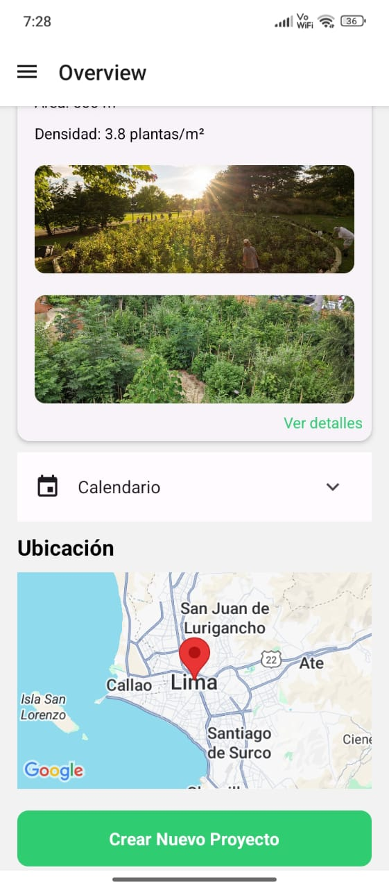
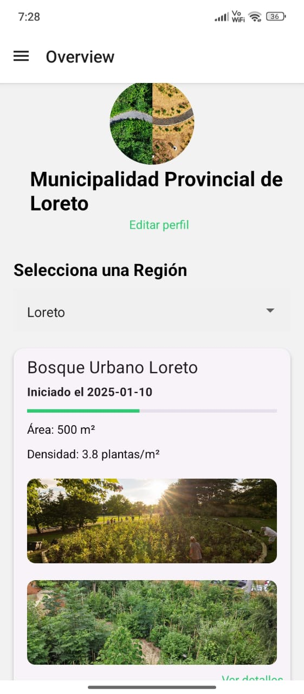
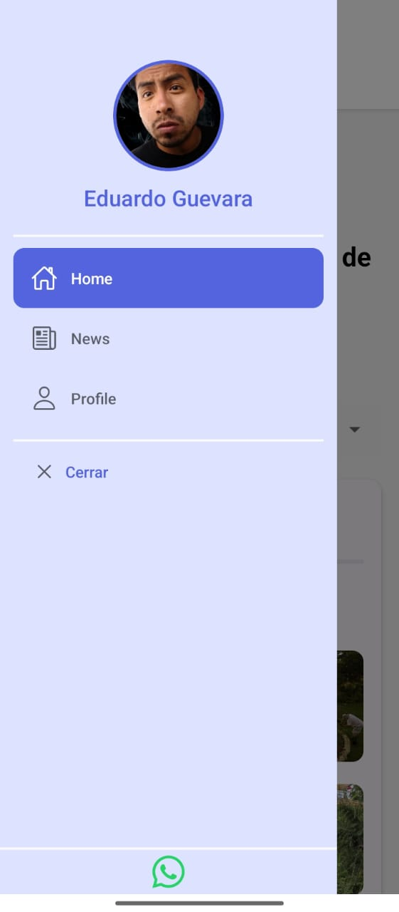

# ForestApp - Plataforma para la creación de bosques mediante la técnica Miyawaki en la Amazonía

## Imágenes de la App

Aquí puedes ver algunas capturas de pantalla de la aplicación **ForestApp**:

 _Vista general del Bosque Urbano Loreto_.

 _Interfaz de usuario con datos de seguimiento_.

 _Vista del mapa con la ubicación del proyecto_.

## Objetivos del Proyecto

- Desarrollar una aplicación móvil para la creación de bosques utilizando el método Miyawaki.
- Permitir a los usuarios realizar un seguimiento detallado de su proyecto de reforestación, incluyendo fechas de riego, limpieza y medición de avance.
- Facilitar la creación de una red social donde los usuarios puedan compartir sus avances y resultados.
- Incluir una base de datos con plantas locales de la región amazónica para guiar a los usuarios en la elección de especies.
